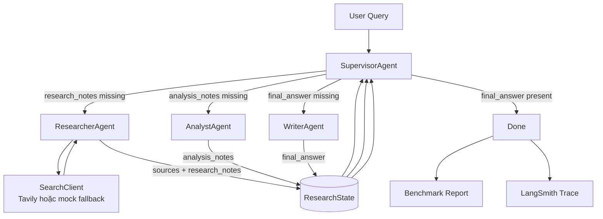
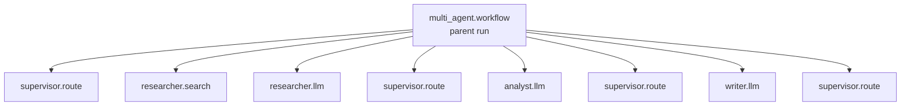

# Multi-Agent Research Lab

Dự án này xây dựng một **research assistant** có 2 chế độ chạy:

- **Single-agent baseline**: một LLM tự trả lời toàn bộ câu hỏi.
- **Multi-agent workflow**: Supervisor điều phối Researcher, Analyst và Writer để tìm nguồn, phân tích, rồi viết câu trả lời cuối cùng có citation.

Hệ thống hiện đã có LLM client, search client, workflow, LangSmith tracing, benchmark report và unit tests.

## Kiến Trúc Agent

```text
User Query
   |
   v
Supervisor
   |
   +--> Researcher -> search sources -> research_notes
   |
   +--> Analyst    -> analysis_notes
   |
   +--> Writer     -> final_answer
   |
   v
Done + Trace + Benchmark Report
```

Sơ đồ agent chi tiết:



Sơ đồ parent/child trace trên LangSmith:



### Vai Trò Từng Agent

| Agent | Nhiệm vụ | Input chính | Output chính |
|---|---|---|---|
| `SupervisorAgent` | Điều phối workflow, quyết định agent tiếp theo, chặn loop vô hạn | `ResearchState` | `route_history`, `iteration` |
| `ResearcherAgent` | Gọi search, tóm tắt nguồn thành research notes ngắn có citation | query, sources | `sources`, `research_notes` |
| `AnalystAgent` | Rút claims, trade-offs, recommendation | `research_notes` | `analysis_notes` |
| `WriterAgent` | Viết final answer ngắn có citation và references | notes, analysis, sources | `final_answer` |
| `CriticAgent` | Optional, kiểm tra citation coverage | final answer, sources | critic result |

Workflow mặc định:

```text
researcher -> analyst -> writer -> done
```

## Cấu Trúc Thư Mục

```text
.
|-- src/multi_agent_research_lab/
|   |-- agents/              # Supervisor, Researcher, Analyst, Writer, Critic
|   |-- core/                # Config, schemas, shared state, errors
|   |-- graph/               # MultiAgentWorkflow với LangGraph + fallback local
|   |-- services/            # LLM client, Tavily/mock search client
|   |-- evaluation/          # Benchmark và markdown report renderer
|   |-- observability/       # Logging và LangSmith tracing
|   `-- cli.py               # CLI entrypoint
|-- tests/                   # Unit tests
|-- reports/                 # Benchmark report
|-- docs/                    # Lab guide, rubric, design notes
|-- .env.example             # Mẫu biến môi trường
`-- pyproject.toml           # Dependencies và project config
```

## Cài Đặt

Yêu cầu Python `>=3.11`.

### 1. Tạo virtual environment

PowerShell:

```powershell
python -m venv .venv
.\.venv\Scripts\Activate.ps1
```

Nếu bị chặn script execution:

```powershell
Set-ExecutionPolicy -Scope Process -ExecutionPolicy Bypass
.\.venv\Scripts\Activate.ps1
```

### 2. Cài dependencies

Cài đầy đủ để chạy LLM, LangGraph, LangSmith, Tavily và test:

```powershell
pip install -e ".[dev,llm,search]"
```

Nếu chỉ muốn chạy offline/mock:

```powershell
pip install -e ".[dev]"
```

## Cấu Hình `.env`

Copy file mẫu:

```powershell
Copy-Item .env.example .env
```

Mở `.env` và điền các key cần thiết:

```env
OPENAI_API_KEY=your_openai_key
OPENAI_MODEL=gpt-4o-mini

TAVILY_API_KEY=your_tavily_key

LANGSMITH_TRACING=true
LANGSMITH_ENDPOINT=https://api.smith.langchain.com
LANGSMITH_API_KEY=your_langsmith_key
LANGSMITH_PROJECT=My project

APP_ENV=local
LOG_LEVEL=INFO
MAX_ITERATIONS=6
TIMEOUT_SECONDS=60
```

Ghi chú:

- Không commit `.env`.
- Nếu không có `OPENAI_API_KEY`, `LLMClient` sẽ dùng offline fallback.
- Nếu không có `TAVILY_API_KEY`, `SearchClient` sẽ dùng mock search.
- Nếu muốn trace lên LangSmith, cần `LANGSMITH_TRACING=true`, `LANGSMITH_API_KEY` và `LANGSMITH_PROJECT`.

## Cách Chạy

### Xem help

```powershell
python -m multi_agent_research_lab.cli --help
```

### Chạy single-agent baseline

```powershell
python -m multi_agent_research_lab.cli baseline --query "Research GraphRAG state-of-the-art and write a 500-word summary"
```

Lệnh này chỉ chạy baseline và in kết quả ra terminal.

### Chạy multi-agent workflow

```powershell
python -m multi_agent_research_lab.cli multi-agent --query "Research GraphRAG state-of-the-art and write a 500-word summary"
```

Kết quả sẽ có:

- final answer
- route history
- sources
- research notes
- analysis notes
- local trace
- LangSmith trace nếu đã bật cấu hình

### Chạy benchmark và cập nhật report

```powershell
python -m multi_agent_research_lab.cli benchmark --query "Research GraphRAG state-of-the-art and write a 500-word summary" --output reports\benchmark_report.md
```

Report được ghi vào:

```text
reports/benchmark_report.md
```

Benchmark so sánh:

- latency
- estimated cost
- quality score
- trace
- failure modes

## LangSmith Tracing

Mỗi lần chạy single-agent baseline sẽ tạo **1 parent run**:

```text
single-agent-baseline
```

Bên trong có child run:

```text
single_agent.llm
```

Mỗi lần chạy multi-agent sẽ tạo **1 parent run**:

```text
multi_agent.workflow
```

Bên trong có các child runs:

```text
supervisor.route
researcher.search
researcher.llm
supervisor.route
analyst.llm
supervisor.route
writer.llm
supervisor.route
```

Nếu không thấy trace trên LangSmith:

1. Kiểm tra `.env` có `LANGSMITH_TRACING=true`.
2. Kiểm tra `LANGSMITH_API_KEY` đúng workspace.
3. Kiểm tra `LANGSMITH_PROJECT` đúng tên project trên UI.
4. Đảm bảo không có 2 dòng `LANGSMITH_PROJECT`; dòng sau cùng sẽ ghi đè dòng trước.

## Search Client

`SearchClient` ưu tiên Tavily nếu có key:

```env
TAVILY_API_KEY=your_tavily_key
```

Nếu Tavily lỗi, chưa cài package, hoặc không có key, hệ thống fallback sang mock search để lab vẫn chạy được.

## Guardrails

Project đã có các guardrails cơ bản:

- `MAX_ITERATIONS`: chặn supervisor loop vô hạn.
- `TIMEOUT_SECONDS`: timeout cho LLM client.
- Retry OpenAI calls với exponential backoff.
- Tavily fallback về mock search.
- Pydantic schemas cho input/output chính.
- Local trace + LangSmith trace.

## Tests

Chạy unit tests:

```powershell
pytest
```

Compile check:

```powershell
python -m compileall -q src tests
```

Lint nếu đã cài `ruff`:

```powershell
ruff check src tests
```

## Kết Quả Benchmark Gần Đây

Trong cấu hình output ngắn hiện tại, benchmark mẫu:

```text
single-agent-baseline | ~13.47s | ~$0.0002 | quality 5.0
multi-agent-workflow  | ~37.79s | ~$0.0008 | quality 10.0
```

Giá trị thực tế có thể thay đổi tùy model latency, Tavily latency và network.

## Files Quan Trọng

- `src/multi_agent_research_lab/cli.py`: CLI commands.
- `src/multi_agent_research_lab/graph/workflow.py`: orchestration workflow.
- `src/multi_agent_research_lab/agents/supervisor.py`: routing policy.
- `src/multi_agent_research_lab/agents/researcher.py`: search + research notes.
- `src/multi_agent_research_lab/agents/analyst.py`: compact analysis.
- `src/multi_agent_research_lab/agents/writer.py`: final answer.
- `src/multi_agent_research_lab/services/llm_client.py`: OpenAI + offline fallback.
- `src/multi_agent_research_lab/services/search_client.py`: Tavily + mock fallback.
- `src/multi_agent_research_lab/observability/tracing.py`: LangSmith parent/child tracing.
- `src/multi_agent_research_lab/evaluation/benchmark.py`: benchmark metrics.
- `reports/benchmark_report.md`: benchmark output.
